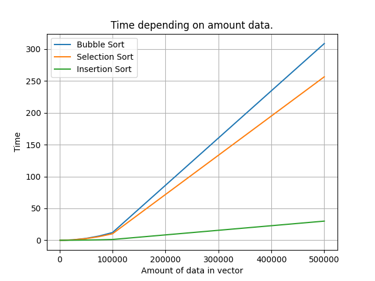

# Sorting Algorithms

Kraków 17 December 2021

---

## Task instructions

### Task 1. Simple sorting algorithms

Implement simple sorting algorithms:

- Bubble Sort
- Selection Sort
- Insertion Sort

Measure the runtime of all implementations above and comapre them.

---

### Task 2. Computational complexity

Modify one selected implementation and add instructions to count the dominant operations.

---

### Task 3. Input generator

Write input generator for the algorithms.

---

## Results

