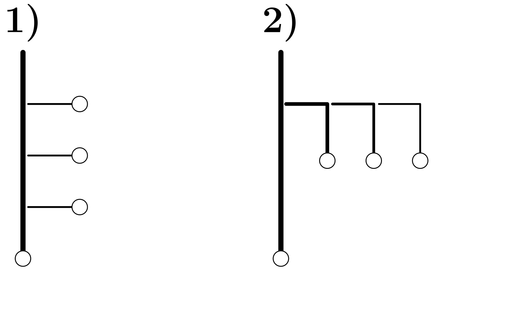

# Exec functions

Kraków 30 March 2021

---

## Task instructions

### Task 1. Trees

Modify the processes.c program from the previous set so that it generates the following process family trees.

*Tree 1*: Parent process 1 has three child processes 2, 3 and 4. \
*Tree 2*: Parent process 1 has a child 2 who has a child 3 who has a child 4.

---

### Task 2. Parent and posterior

Modify the program processes.c so that messages of child processes are printed by the program started with the execv () function.

---

### Task 3. Zombie and orphan

Write programs for creating zombie process and orhpan process.
